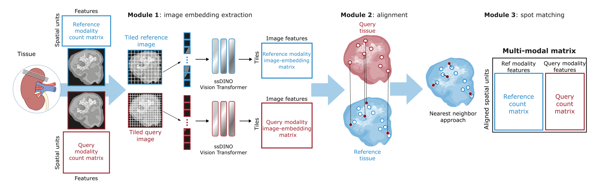

#  ⚓  COAST: Consecutive multi-Omics Alignment of Spatial Tissues
##### Author: Benedetta Manzato

This repository contains a python implemetation for COAST. COAST leverages the tissue images assocuated with spatial molecular data to obtain the physical alignment of consecutive uni- and multi-modal sections.



- **Module 1: extract images features with ssDINO** (```bash extract_features.py```) takes as an input the coordinate file and the high-resolution images and returns the image embedding of each patch obtained from the two images using a ImageNet-pre-trained Vision Transformer (ssDINO). 
- **Module 2: map spots across modalities with CAST** (```bash CAST_alignment.py```): Building on CAST Stack, a method for alignment of uni-modal consecutive sections, we map the coordinates of the query section in the reference coordinate system based on the similarity of the transformer embeddings. First by applying a rigid alignment, then by free-form deformation (FFD) with the learned image features.
- **Module 3: Spot matching** (```bash spot_matching.py```): matches spots between tissues using KD-tree based on the closest Euclidean distance (using a maximum distance threshold).
- **Visualization**: Computes UMAP followed by k-means clustering and generates UMAP plots for the image embeddings (colored by cluster and section). After CAST alignemnt, it plots the query-coordinates mapped in the reference coordinate framework.

### Tutorial
The ```COAST_tutorial``` notebook is a step-by=step example of the application of COAST on two consecutive sections of the Mouse Brain Sagittal Anterior (10X Genomics, [section 1](https://www.10xgenomics.com/datasets/mouse-brain-serial-section-1-sagittal-anterior-1-standard-1-1-0), [section 2](https://www.10xgenomics.com/datasets/mouse-brain-serial-section-2-sagittal-anterior-1-standard-1-1-0))


### Install Dependencies

You can install the necessary dependencies using the following command:

```bash
pip install -r requirements.txt
```

If you use this repository in your research, please cite biorxiv link

### Citations 
- [ssDINO](https://arxiv.org/abs/2104.14294) ([github](https://github.com/facebookresearch/dino))
- [CAST](https://www.nature.com/articles/s41592-024-02410-7) ([github](https://github.com/wanglab-broad/CAST))


#### Contact
b.manzato@lumc.nl
